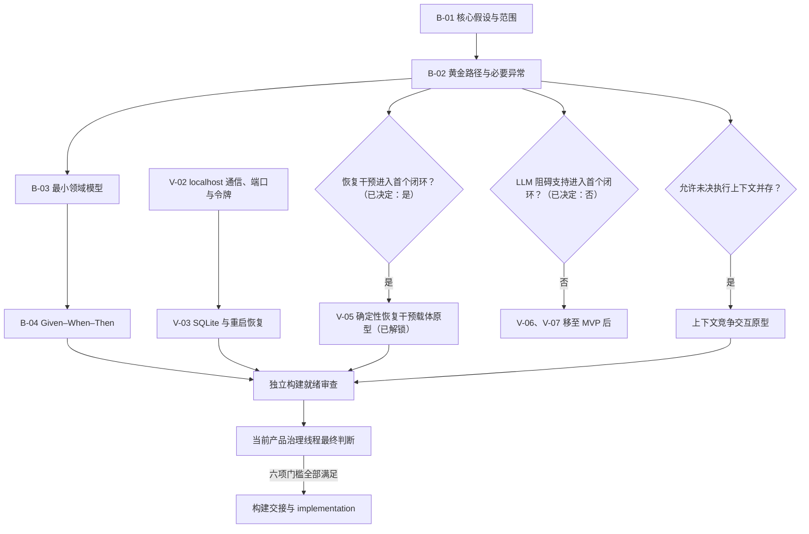

# MVP 构建就绪多 session 编排

## 适用范围

本文档规定从当前产品决策推进到第一个 MVP 构建交接时，工作如何在当前产品治理线程和独立执行 session 之间流转。六项门槛的实时状态、最高阻塞项和验证任务清单仍以 [MVP 构建就绪门槛](mvp-build-readiness.md) 与 Issue #10 为准；本文档只维护稳定的编排规则。

读取本文档不会激活产品治理角色。产品治理身份仍只能由当前用户指令或任务 Prompt 显式激活；research、prototype、technical spike、implementation、debugging 和 code review session 均不自动继承该角色。

## 单一控制点

当前产品治理线程是六项门槛的控制点，负责：

- 与用户确认核心假设、黄金路径、领域模型和验收标准；
- 定义独立任务的验证问题、范围、验收和退出条件；
- 接收证据并判断其是否改变 MVP 范围、领域模型、ADR 或门槛状态；
- 维护未决事项分类，并作出最终构建就绪判断。

独立 session 只负责其任务 Prompt 授权的证据、原型、实现或审查，不得宣告 MVP 构建就绪，也不得自行修改产品范围、领域模型或 ADR。

## 六项门槛的路由

| 门槛 | 当前产品治理线程 | 可交给独立 session 的工作 |
| --- | --- | --- |
| 1. 核心假设与范围 | 确认目标用户、首要场景、行为变化、成功标准和不做项 | 只读研究可以提供事实，不替用户作取舍 |
| 2. 第一个端到端垂直闭环 | 固定黄金路径和必要异常，决定裁剪边界 | 必须通过实际体验判断的交互问题交给 prototype |
| 3. 核心领域模型 | 确认权威对象、状态、命令、事件和转换 | technical spike 只验证持久化、通信和恢复机制，不命名正式领域语义 |
| 4. 可验证的验收标准 | 编写并接受 Given–When–Then 场景 | 独立 review 可以查漏和指出矛盾，不新增产品规则 |
| 5. 高风险技术假设 | 定义任务并接纳证据 | research、prototype 或 technical spike 负责真实环境验证 |
| 6. 未决事项分类 | 维护四类归档和最终门槛状态 | 独立 audit 可以报告遗漏，不改变分类 |

## 依赖图

条件节点为“否”时，对应能力按构建就绪文档重新归入实现中再决定或 MVP 后，不再阻塞首个闭环。B-02 已决定确定性恢复干预进入首个 MVP，V-05 已解锁；其 prototype 只验证本机载体与上下文返回，不得增加 LLM、缩小步骤或方案调整。B-02 同时决定首个 MVP 不包含“现在有点难开始”分支和完整 LLM 阻碍支持，因此 V-06、V-07 不创建首个 MVP 的 Issue 或 session；它们保留为后续的缩小步骤 prototype / eval，以及 PydanticAI 供应商切换、模型不可用回退和权威状态独立性 technical spike。图中的其他连线表达最晚依赖；不适用的条件分支不需要创建 Issue 或 session。

## 独立任务生命周期

1. **定义**：当前产品治理线程建立 Issue，写全验证问题、范围内、范围外、验收条件、退出条件、交付物和可直接使用的新对话 Prompt。完成标准是执行者无须自行补写产品规则。
2. **启动**：独立 session 从满足依赖后的最新 `main` 创建独立分支和 Draft PR。完成标准是 Issue、branch、checkpoint 和 Draft PR 相互链接。
3. **执行**：session 只生产任务范围内的证据。依赖 Windows 实机或用户体验时，在准备完成后暂停等待，不从 Linux、mock 或代码检查外推结论。
4. **回传**：session 回报 `PASS / FAIL / BLOCKED`、证据、限制、尝试次数、风险和 ADR 冲突。完成标准是另一名审查者可以把结论追溯到环境、commit 和证据。
5. **复审**：当前产品治理线程审查交付范围与证据；必要时使用独立 code review session 辅助。技术结论只有经治理接纳后才改变门槛状态。
6. **合并**：产品治理线程明确提醒用户审查；由用户决定 Ready、合并方式和时间。上游结果合并且 Issue 关闭后，依赖任务才从最新 `main` 启动。
7. **更新**：当前产品治理线程更新 Issue #10、构建就绪文档和未决事项分类，再选择唯一最高优先级的阻塞项。

## 并发与分支规则

- 默认同时维持一条产品决策车道和一条技术/原型车道；需要用户操作 Windows 时，只保留一个等待用户执行的 Windows 任务。
- 相互独立且不会修改同一契约的证据任务可以并行；存在协议、数据或状态语义依赖时顺序执行。
- 依赖任务默认等待上游 PR 合并后从最新 `main` 开始，不用 stacked PR 绕过尚未接纳的证据。
- 每个 Issue 使用独立分支和 Draft PR；执行 session 不标记 Ready、不合并，也不把 spike 或 prototype 计作 MVP 功能。
- 完整门槛满足前不启动 implementation。门槛满足后的任务按端到端垂直切片组织，而不是长期按前端、后端或 Agent 层割裂。

## 构建就绪审查与交接

所有适用分支证据合并后，可以建立一次独立、只读的构建就绪审查。该审查逐项核对六项门槛、文档与 Issue 可追溯性、未决事项分类和 implementation 任务契约，只报告遗漏或冲突。

最终结论仍由当前产品治理线程作出。只有六项门槛全部满足时，当前线程才暂停 grilling，明确宣布“MVP 已达到可以开始构建的状态”，并输出构建交接报告。
